# Geodis非货仓储管理系统 - 使用说明

## 目录

* [权限说明](#md-anchor0)
* [数据录入](#md-anchor)
* [入库](#md-anchor1)
* [出库](#md-anchor2)
* [库存盘点](#md-anchor3)
* [库存转移](#md-anchor4)
* [报表](#md-anchor5)

## <a name="md-anchor" id="md-anchor0">权限说明</a>

  每个用户账号在该系统内的权限由用户所属公司种类及用户拥有的角色这两者决定。公司种类有`客户公司`及`管理公司`两种。每个公司预定有`管理员`、`清点员`、`操作员`这三种用户角色。

#### 客户公司

  每个`客户公司`的`管理员`可以录入以下数据：

    * 用户
    * 品牌
    * 供应商
    * 收货人
    * 商品

  不同`客户公司`只能看到自己商品的库存及针对该库存下单。具体请参见 [数据录入](#md-anchor)

#### 管理公司

  系统中的`管理公司`有且只有一个，`管理公司`的`管理员`可以录入一些系统数据：

    * 公司
    * 仓库
    * 库位
    * 种类

#### 用户角色

  三种用户角色的权限是预定义的，不提供修改。例如`管理员`拥有公司[数据录入](#md-anchor)权限，`操作员`可操作[入库](#md-anchor1)、[出库](#md-anchor2)，`清点员`查看公司具体营运情况，[导出报表](#md-anchor5)。

  每个用户的角色可以是多个。

## <a name="md-anchor" id="md-anchor">数据录入</a>

  每种数据的录入功能都类似：可单一录入，通过网页表格录入数据提交；也可批量excel导入。这里我用录入 `公司` 数据做个例子，其他的 `仓库` 、 `库位` 、 `种类` 、 `用户` 、 `品牌` 、 `供应商` 、 `供货人` 、 `商品` 数据录入功能都类似。

#### 公司数据录入

  可通过菜单 `公司` - `新增公司` 录入公司数据提交保存。

  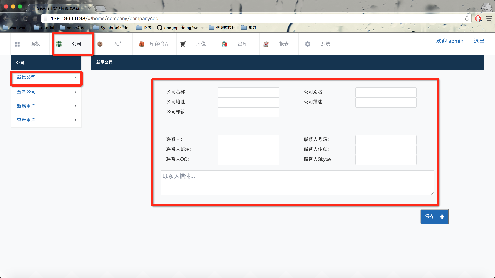

  也可通过 `系统` - `公司数据导入` 批量导入。注：导入的excel数据格式一定要严格符合模板，模板可在数据导入页面下载。

  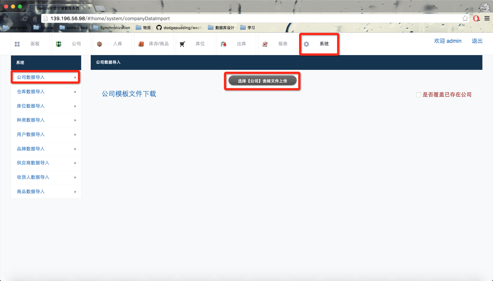

  批量导入时，若勾选了 `是否覆盖已存在公司` ，可对此时系统里已存在的同名公司进行修改。

#### 备注

  在录入数据时，有些数据必须事先录入完毕。比如在批量导入 `商品` 数据时，`商品` 所属的 `品牌` 和 `种类` 都必须已存在于系统， 不然会报错。

#### 商品图片管理

  可在 `库存/商品` - `新增商品` 时上传商品图片，也可在 `库存/商品` - `查看商品` 时编辑商品图片。

  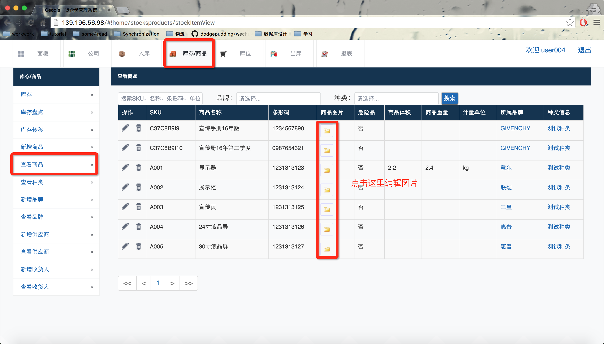

## <a name="md-anchor1" id="md-anchor1">入库</a>

#### 新增商品入库

  通过 `入库` - `新增入库` 新增入库订单：

  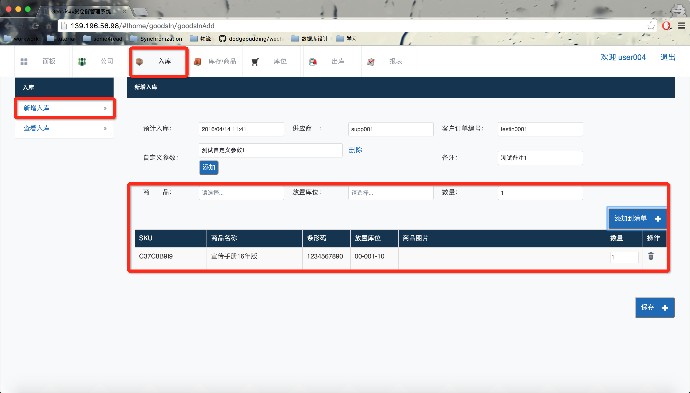

  需要注意的是，每个库位上只可以存放一个SKU商品。保存后，系统会为每个入库订单自动生成订单编号，请注意这个订单编号有别于在上图中由用户输入的 `客户订单编号`，每个订单编号代表一个批次。

  在 `入库` - `查看入库` 确认订单则表示订单生效，商品入库完毕。

  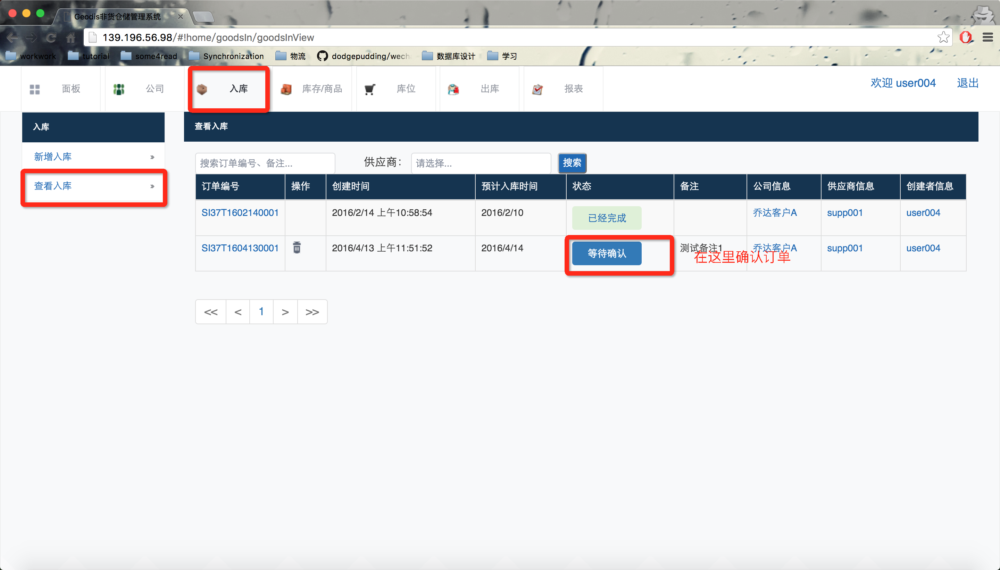

  确认后：

  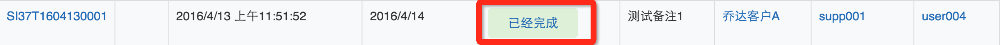

  在 `库存/商品` - `库存` 可查看所有库存：

  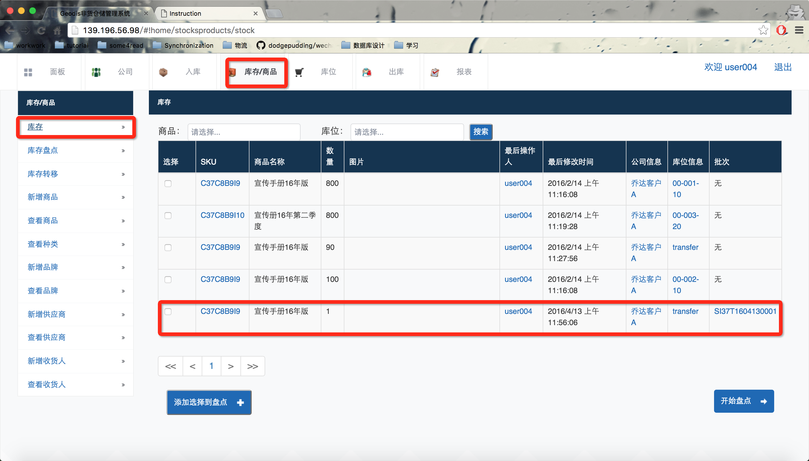

## <a name="md-anchor1" id="md-anchor2">出库</a>

  可针对不同批次的库存商品进行出库操作，操作类似于上方的[入库](#md-anchor1)。

  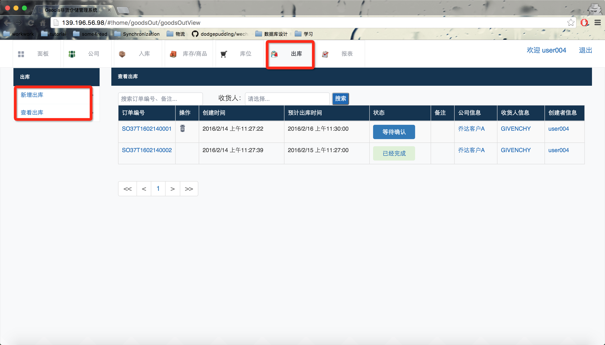

## <a name="md-anchor1" id="md-anchor3">库存盘点</a>

  通过 `库存/商品` - `库存盘点` 使用盘点功能，以使系统中的库存与实际库存相匹配。操作步骤如下：

1. 在 `库存/商品` - `库存` 界面中选择此次盘点的目标库存商品。
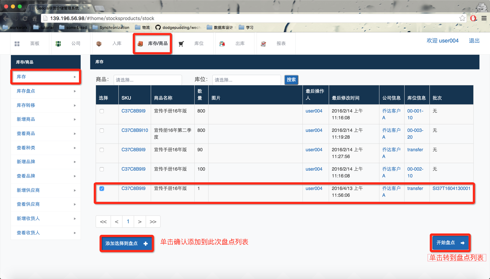
2. 在 `库存/商品` - `库存盘点` 界面中修改盘点数量并保存即可完成盘点操作。
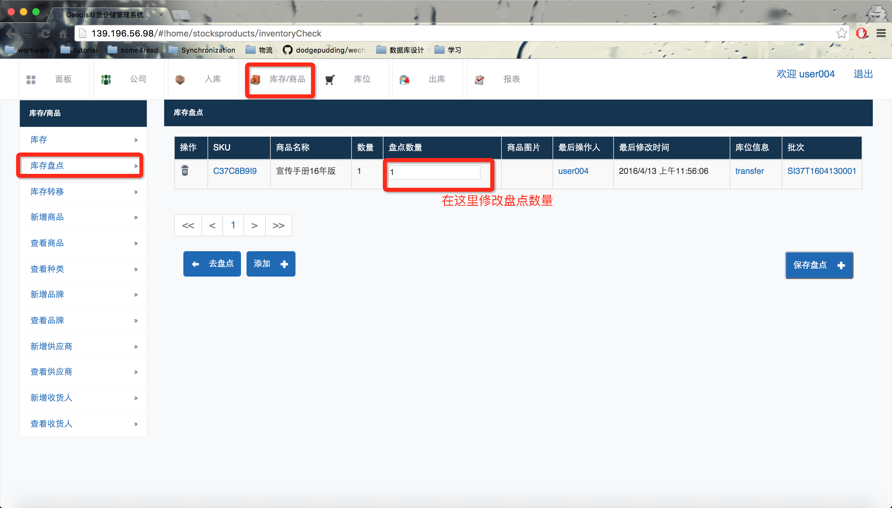

#### 添加盘点

可对空闲库位添加商品进行盘点。

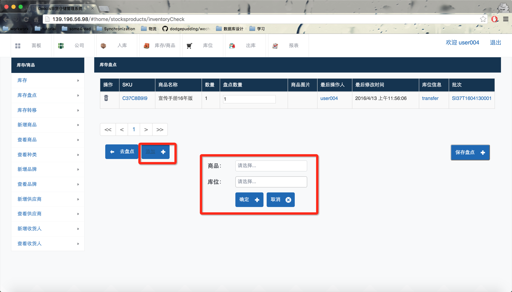

## <a name="md-anchor1" id="md-anchor4">库存转移</a>

可将针对不同批次的库存商品转移至其它库位：

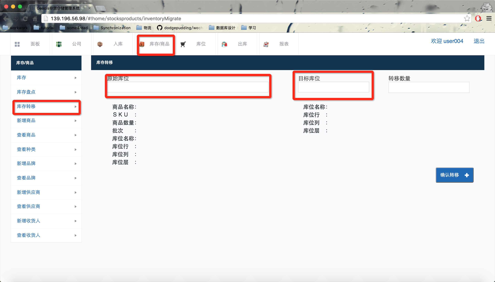

## <a name="md-anchor1" id="md-anchor5">报表</a>

本系统提供以下几种报表导入：`营运报表`、 `结算报表`、`入库报表(汇总)`、 `入库报表(明细)`、`出库报表(汇总)`、 `出库报表(明细)`、`库存报表` 、 `库位报表`，具体可以前至 `报表` 查看。

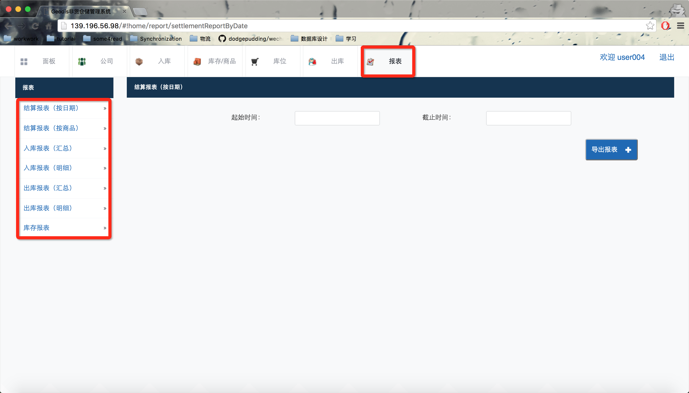